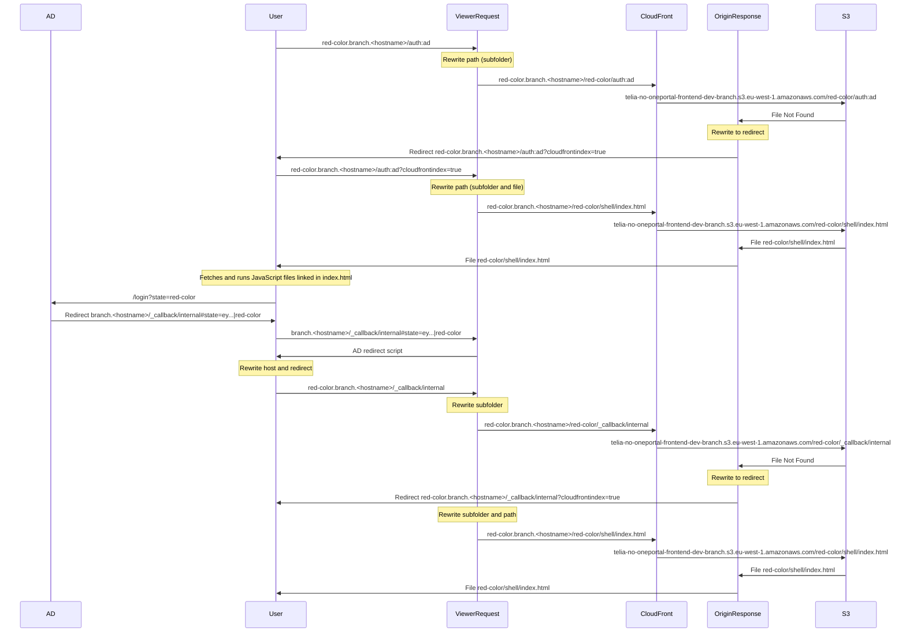

# Terraform Module for Cloudfront Subdomains

Terraform module which creates a Cloudfront resource in AWS, which dynamically
maps subdomains to static files in subfolders of a  S3 bucket.

## Usage

See the [example](examples/basic/README.md).

## Example request flow

## Authors

Currently maintained by [these contributors](../../graphs/contributors).

## License

MIT License. See [LICENSE](LICENSE) for full details.
